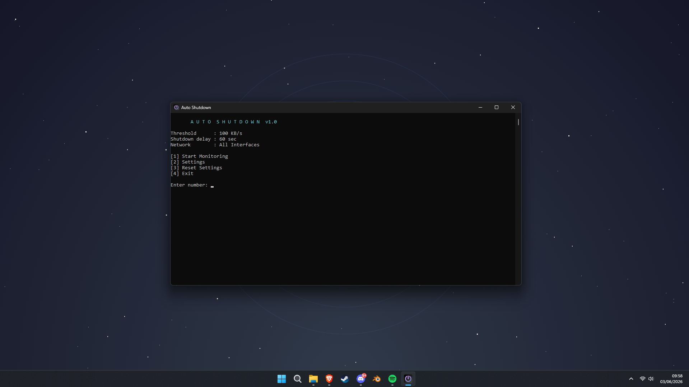

# Auto Shutdown

A lightweight Windows utility that automatically shuts down your PC after a download or upload finishes.

Auto Shutdown monitors your internet activity while a download or upload is active. Once the task appears to be complete, it starts a visible shutdown countdown, giving you time to cancel. If network activity increases during the countdown, the shutdown is cancelled automatically.



## Features

* Automatically shuts down your PC after downloads or uploads finish
* Simple, easy-to-use interface
* Shows your current network speed
* Gives you time to cancel before shutting down
* Cancels the shutdown automatically if network activity increases
* Supports Wi-Fi, Ethernet, or all network connections
* Includes safeguards for connection problems
* Lets you adjust the activity threshold and shutdown delay
* Tested and refined for reliable everyday use

## Installation

Download the latest installer from the **Releases** section and run:

```text
AutoShutdownSetup.exe
```

## Usage

1. Open Auto Shutdown.
2. Select **Start Monitoring**.
3. Leave the utility running while your download or upload continues.
4. Press **A** at any time to cancel.

When your task appears to be complete, Auto Shutdown begins a countdown before shutting down Windows.

## Settings

You can change:

* **Threshold** — how low your network activity must fall before the countdown begins
* **Shutdown delay** — how long you have to cancel before your PC shuts down
* **Network** — whether the utility monitors Wi-Fi, Ethernet, or all connections

## Note

Auto Shutdown monitors network activity rather than detecting downloads or uploads directly. Background internet activity may affect when the countdown begins.

## License

This project is licensed under the MIT License.
